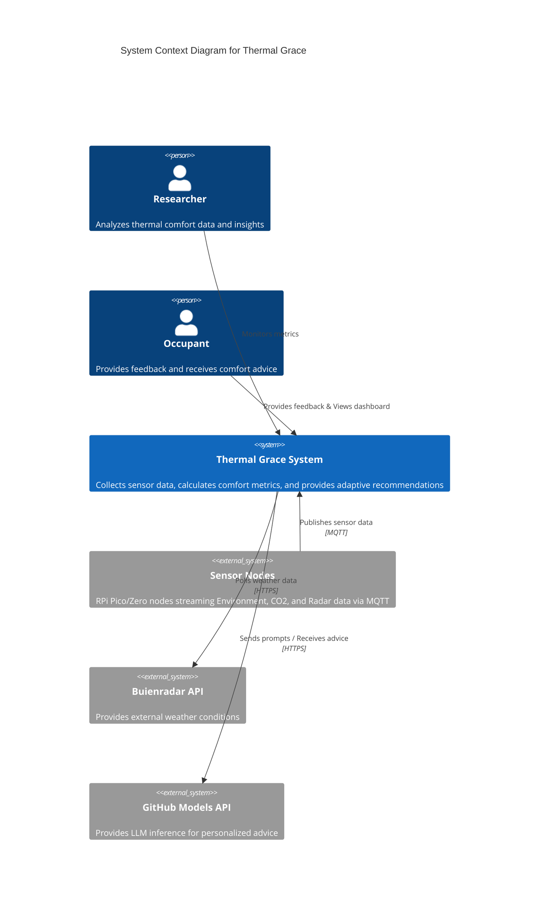
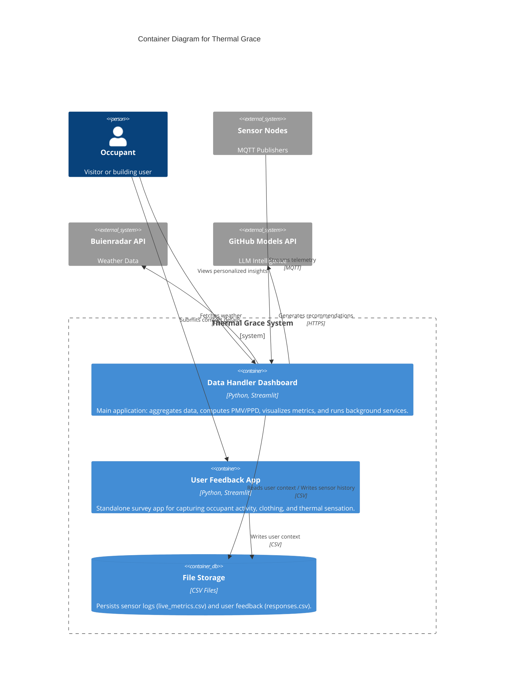
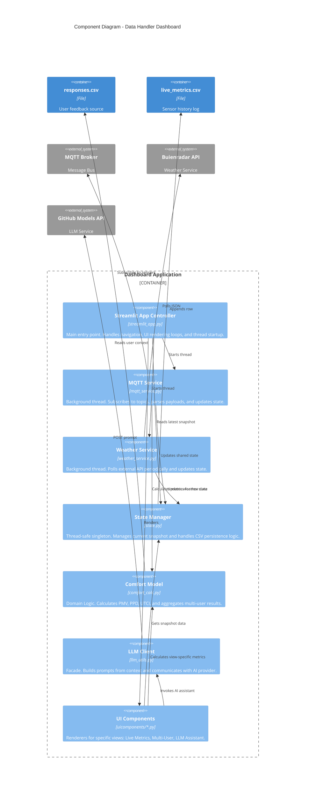

# Thermal Grace - System Architecture

This document describes the architecture of the **Thermal Grace** Perceived Thermal Comfort system using the [C4 model](https://c4model.com/).

## Level 1: System Context Diagram
This diagram shows the high-level system boundary and its interactions with users and external entities.



## Level 2: Container Diagram
This diagram zooms into the **Thermal Grace System** to show its high-level executable units and data stores.



## Level 3: Component Diagram (Dashboard)
This diagram details the internal components of the **Data Handler Dashboard** container.




## 4. Component Details

### 4.1 Edge Devices (Raspberry Pi Pico W)

- **Hardware**: Raspberry Pi Pico W (RP2040 + WiFi)
- **Firmware**: MicroPython
- **Sensors Supported**:
  - BME680: Temperature, humidity, air pressure, VOC
  - mmWave Radar: Occupancy detection (2D)
  - GRID-EYE: Thermal imaging (heatmap)
- **Communication**: MQTT (paho-mqtt library)
- **Power**: USB-C (5V)

### 4.2 MQTT Broker

- **Software**: Mosquitto (or HiveMQ)
- **Topics**:
  - `sensors/pico1/bme680` - BME680 sensor data
  - `sensors/pico1/radar` - Radar occupancy data
  - `sensors/pico1/grideye` - GRID-EYE thermal data
  - `feedback/user` - User feedback from survey app

### 4.3 Data Handler (Python)

- **Location**: `data_handler/` directory
- **Functionality**:
  - Subscribe to MQTT topics
  - Parse sensor data
  - Store data in CSV files
  - Provide data to Streamlit app
  - Calculate PMV/PPD metrics
  - Integrate with external APIs

### 4.4 Streamlit Dashboard

- **Location**: `data_handler/` directory
- **Features**:
  - **Live Metrics**: Real-time sensor data display
  - **Multi-User Comfort**: Adaptive PMV/PPD for multiple users
  - **LLM Assistant**: AI-powered insights and recommendations
  - **Radar Visualization**: 2D occupancy heatmap
  - **Thermal Visualization**: GRID-EYE thermal heatmap
  - **Weather Integration**: Real-time outdoor weather data

## 5. Data Flow

1. **Sensor Data Acquisition**:
   - Pico W reads sensors (BME680, Radar, GRID-EYE)
   - Data is formatted as JSON
   - JSON is published to MQTT broker

2. **Data Processing**:
   - Data Handler subscribes to MQTT topics
   - Sensor data is parsed and validated
   - User feedback is processed from `feedback/user` topic
   - Data is stored in CSV files:
     - `sensor_data.csv` - Time-series sensor readings
     - `responses.csv` - User feedback and comfort ratings

3. **Visualization and Analysis**:
   - Streamlit app polls Data Handler for latest data
   - **Multi-User Comfort**: Calculates PMV/PPD for all users
   - **LLM Assistant**: Generates insights using GitHub LLM
   - **Radar Visualization**: Displays occupancy heatmap
   - **Thermal Visualization**: Displays thermal heatmap
   - **Weather Integration**: Fetches outdoor weather data

## 6. Key Features

### 6.1 Multi-User Adaptive Comfort

- Tracks comfort preferences for multiple users
- Calculates personalized PMV/PPD based on:
  - Air temperature
  - Relative humidity
  - Radiant temperature
  - Air velocity
  - Metabolic rate (activity level)
  - Clothing insulation
- Adapts to changing environmental conditions

### 6.2 LLM-Powered Insights

- Uses GitHub LLM for natural language explanations
- Provides actionable recommendations for comfort improvement
- Answers user questions about thermal comfort
- Analyzes multi-user feedback for group insights

### 6.3 Advanced Sensor Integration

- **mmWave Radar**: Occupancy detection with 2D visualization
- **GRID-EYE**: Thermal imaging with heatmap visualization
- **BME680**: Comprehensive environmental monitoring

### 6.4 Weather Integration

- Fetches real-time outdoor weather data
- Calculates outdoor comfort metrics
- Provides comparative analysis between indoor and outdoor conditions

## 7. Technology Stack

- **Hardware**: Raspberry Pi Pico W
- **Firmware**: MicroPython
- **Communication**: MQTT (paho-mqtt)
- **Backend**: Python 3.x
- **Frontend**: Streamlit
- **Data Storage**: CSV files
- **AI/ML**: GitHub LLM API
- **Sensors**: BME680, mmWave Radar, GRID-EYE

## 8. Setup and Installation

### 8.1 Hardware Setup

1. Connect sensors to Raspberry Pi Pico W:
   - BME680: I2C (SCL/SDA/VCC/GND)
   - mmWave Radar: GPIO (TX/RX/VCC/GND)
   - GRID-EYE: SPI (MOSI/MISO/SCK/CS/VCC/GND)

2. Power the Pico W via USB-C

### 8.2 Software Setup

1. Install MicroPython on Pico W
2. Install libraries:
   ```bash
   pip install paho-mqtt
   pip install bme680
   pip install adafruit-circuitpython-mlx90640
   ```

3. Install Data Handler dependencies:
   ```bash
   pip install streamlit paho-mqtt pandas requests
   ```

4. Configure MQTT:
   - Update `data_handler/mqtt_config.py` with broker details

5. Configure Weather API:
   - Get API key from OpenWeatherMap
   - Update `data_handler/weather_integration.py`

6. Configure GitHub LLM:
   - Get API token from GitHub
   - Update `data_handler/llm_utils.py`

### 8.3 Run the System

1. Start the Data Handler:
   `cd data_handler && streamlit run streamlit_app.py`
