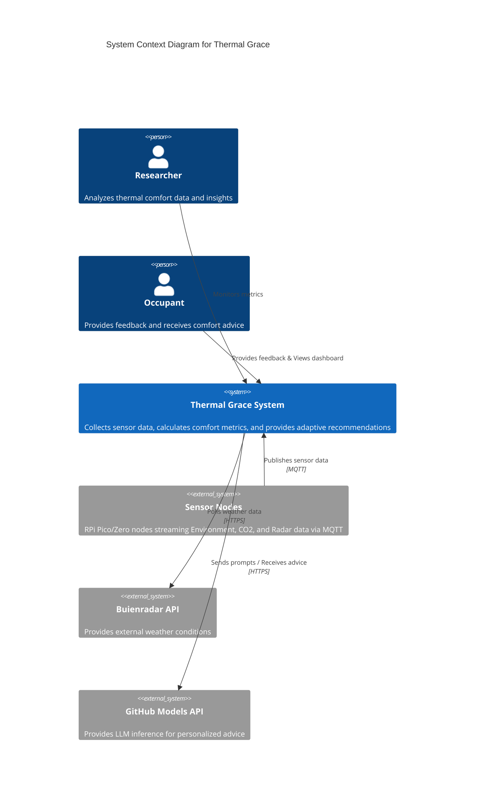
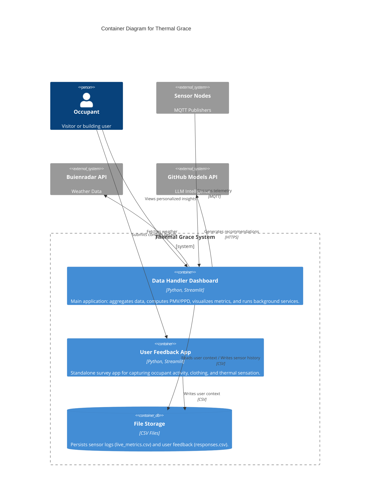
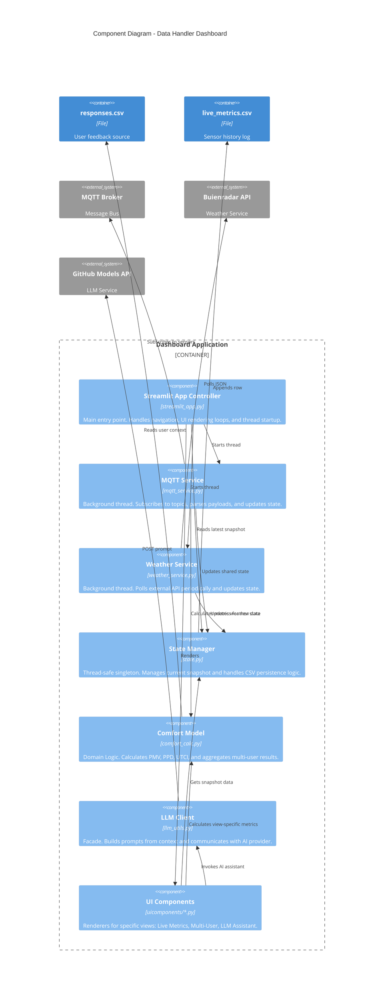

# Thermal Grace - System Architecture

This document describes the architecture of the **Thermal Grace** Perceived Thermal Comfort system using the [C4 model](https://c4model.com/).

## Level 1: System Context Diagram
This diagram shows the high-level system boundary and its interactions with users and external entities.

## Level 2: Container Diagram
This diagram zooms into the **Thermal Grace System** to show its high-level executable units and data stores.

## Level 3: Component Diagram (Dashboard)
This diagram details the internal components of the **Data Handler Dashboard** container.

